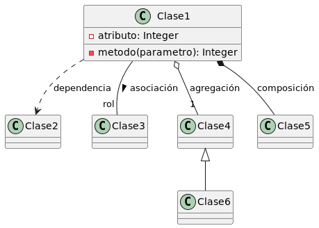
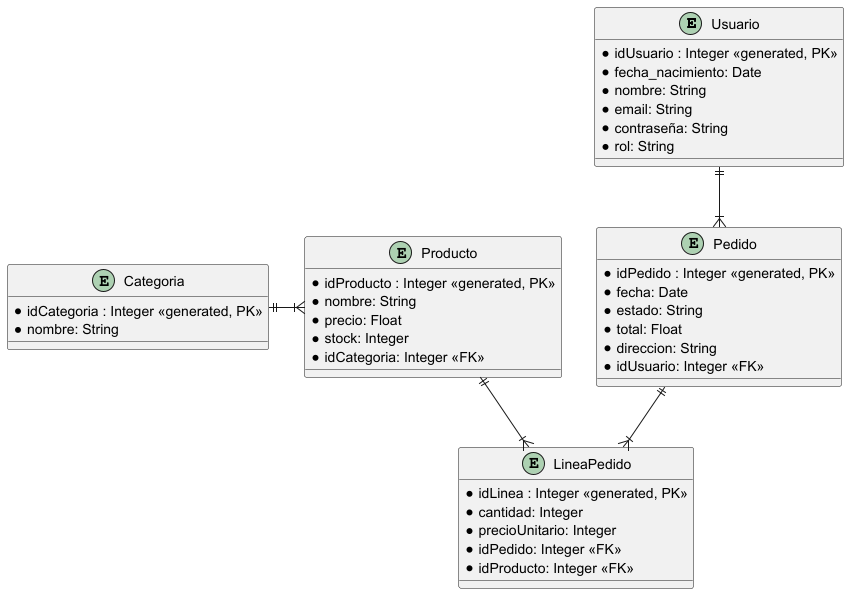

# Mi Gran Proyecto

[Historial de cambios](./CHANGELOG.md)

...

## Algunas ideas:

* ¿Cómo escribir un fichero README.md? https://www.makeareadme.com/
* Un  [ejemplo](https://gist.github.com/PurpleBooth/109311bb0361f32d87a2)
* ¿Qué tal una probar una app? https://readme.so

## Diagrama de Clases

 
> Nota: para modificar el diagrama puedes editar el fichero `.puml` y con el botón derecho
> sobre el diagrama visualizado almacenar la imagen generada y referenciarla dentro de este documento 

## Diagrama ER

## 🌐 Despliegue de la aplicación

### Pablo
## URLs de despliegue

- Pablo:
  http://35.184.164.235/app/hello-servlet
# Mi Gran Proyecto

## Nombre del proyecto
DAWMarket

## Descripción del proyecto
DAWMarket es una aplicación web orientada a la gestión y 
compra online de productos de alimentación. Los usuarios 
pueden consultar el catálogo de productos organizados por 
categorías y, tras registrarse, realizar pedidos y consultar 
su historial. El sistema permite gestionar información 
persistente sobre usuarios, productos, pedidos y relaciones 
entre ellos. Además, cuenta con funcionalidades de 
administración para mantener el catálogo y supervisar la 
actividad.

## Miembros del proyecto
* Eduardo Calvo Almeida
* Pablo González Rodríguez
* Luis Carlos Galán Molina

## Requisitos funcionales
* Como usuario quiero:
  * Consultar los productos
  * Filtrar por categorías
  * Crear una cuenta y poder acceder con ella
  * Gestionar el carrito/pedido
  * Consultar mi historial de pedidos
* Como administrador quiero:
  * Gestionar los productos/categorías
  * Gestionar los pedidos
  * Gestionar los usuarios

## URLs públicas 
 * http://34.28.226.57/  (Luis Carlos)
 * Pablo: http://136.116.181.215:8080/index.xhtml
 * Eduardo: http://136.119.227.42/

## Storyboard

## Diagrama ER

Main
